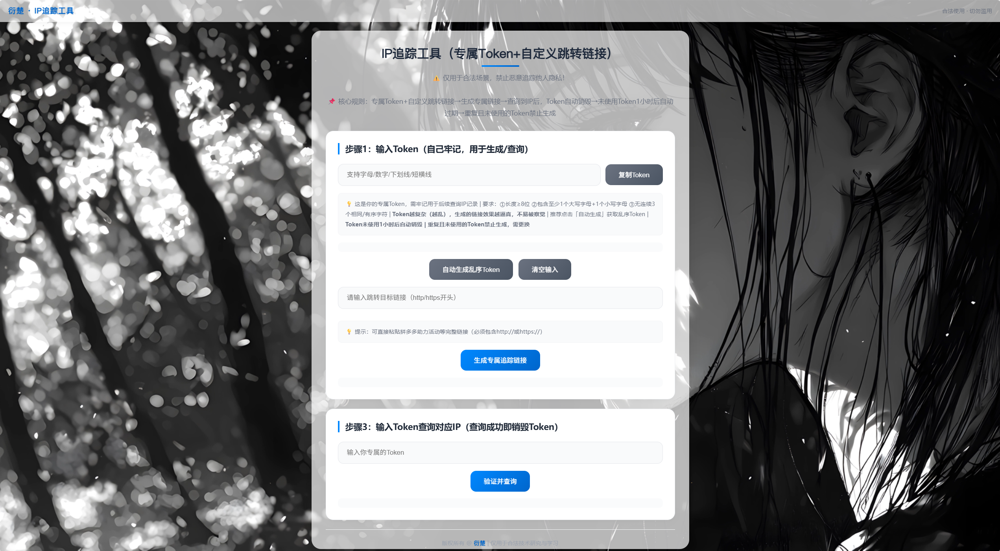

<h1 align="center">IP 追踪工具</h1>

<p align="center">
  <b>零成本获取访问者真实 IP，无需服务器、无需备案、无需公网 IP</b>
</p>

<p align="center">
  <a href="https://www.python.org/downloads/"></a>
  <a href="https://flask.palletsprojects.com/"></a>
  <a href="LICENSE"></a>
</p>

<p align="center">
  
  
  
  
</p>

<p align="center">
  <b>一键生成追踪链接 → 用户点击 → 无感知跳转 → 精准获取 IP</b>
</p>

<p align="center">
  
</p>

---

## 为什么选择这个项目？

> **你不需要买服务器、不需要备案、不需要公网 IP，只要有台电脑，30 秒就能搭建一个公网 IP 追踪服务。**

| 痛点 | 传统方案 | 本方案 |
|------|:--------:|:------:|
| 零成本部署 | ❌ 需买服务器（年费百元起） | ✅ 完全免费 |
| 自动域名更新 |  域名变了要手动改配置 | ✅ 全自动更新 |
| 微信内打开 | ❌ 自定义域名常被拦截 | ✅ cpolar.top 打开成功率高 |
| 用户是否察觉 | ❌ 中间页停留暴露意图 | ✅ 瞬间跳转，完全无感知 |
| IP 精准度 | ❌ 代理后拿到内网 IP | ✅ 多层代理穿透 |
| 部署复杂度 | ❌ Docker / Nginx / SSL | ✅ 一键启动 |
| Token 安全 | ❌ 可重复利用 | ✅ 一次销毁 |
| 后台清理 | ❌ 手动管理 | ✅ 智能定时清理 |

---

## 核心优势

| 优势 | 说明 |
|------|------|
| **用户无感知** | 瞬间跳转，无中间页，完全感知不到 IP 被记录 |
| **微信高成功率** | cpolar.top 域名在微信内打开成功率极高，不易被拦截 |
| **零成本** | 免费账户即可运行，无需服务器、无需备案 |
| **全自动** | Cpolar 自动登录 → 域名自动更新 → 服务自动启动 |
| **高精度** | 多层代理穿透，优先读取 X-Real-IP 获取真实 IP |
| **安全** | secrets 模块生成 Token，一次性使用后立即销毁 |

---

## 应用场景

以下场景均可使用本工具快速获取目标真实 IP：

| 场景 | 适用 |
|------|:----:|
| 设备丢失找回 — 电脑/手机被盗后，一旦设备联网即可获取 IP | ✅ |
| 网络欺诈追踪 — 遭遇网络诈骗后，获取对方真实 IP | ✅ |
| 账号安全排查 — 发现异常登录，确认访问者位置 | ✅ |
| 社工库验证 — 验证他人提供的 IP 是否与声称位置一致 | ✅ |
| 渗透测试授权 — 在授权范围内测试目标 IP 暴露情况 | ✅ |

> 请合法使用本工具，遵守当地法律法规。详见 [法律声明](#法律声明)。

---

## 30 秒快速开始

### 前置准备

- [x] 安装 [Python 3.8+](https://www.python.org/downloads/)
- [x] 安装 [Cpolar](https://www.cpolar.com/)（免费账户即可）
- [x] 在 Cpolar 中创建隧道，指向 `127.0.0.1:5000`

### 一键部署

```powershell
# 1. 克隆项目
git clone https://github.com/Siryecn/ip-tracker.git
cd ip-tracker

# 2. 安装依赖
python -m venv venv
.\venv\Scripts\Activate.ps1
# 若使用CMD，替换为：.venv\Scripts\activate.bat
pip install -r requirements.txt
playwright install chromium
# 无科学上网下载chromium时稍慢，请耐心等待

# 3. 配置 Cpolar 账号密码
copy .env.example .env
# 编辑 .env，填入你的 Cpolar 账号密码即可
# DOMAIN 无需填写，会自动更新！

# 4. 启动(双击bat后等待几秒)
run_iptanzhen.bat
```

就这么简单，服务已在公网运行！

---

## 详细使用指南

### Cpolar 配置（首次使用）

#### 1. 下载并安装 Cpolar

- 官网：[https://www.cpolar.com/](https://www.cpolar.com/)
- 下载 Windows 客户端并安装

#### 2. 注册/登录账号

- 安装完成后访问 `http://localhost:9200` 进入 Cpolar 管理页面
- 注册账号或使用已有账号登录

#### 3. 创建隧道

| 参数 | 值 |
|------|------|
| 隧道名称 | `ip-tracker`（自定义） |
| 协议 | `HTTP` |
| 本地地址 | `127.0.0.1:5000` |
| 域名类型 | **免费随机域名**（无需付费，自动分配） |

保存并启动隧道。

> 无需手动记录公网域名，启动工具会自动获取并更新。

### 环境变量配置

创建 `.env` 文件：

```bash
copy .env.example .env
```

只需修改以下两项：

```env
# DOMAIN 无需填写，启动工具会自动获取
DOMAIN=https://placeholder.cpolar.top

# 只需填写这两项
CPOLAR_ACCOUNT=your-email@example.com
CPOLAR_PASSWORD=your-password
```

### 启动方式

| 方式 | 命令 | 适用场景 |
|------|------|----------|
| 一键脚本（推荐） | `run_iptanzhen.bat` | 自动登录 → 提取域名 → 更新配置 → 启动服务 |
| 手动启动 | `.\venv\Scripts\python.exe IP.py` | 开发 / 调试场景 |

---

## 使用流程

```
生成链接 → 发送链接 → 用户点击 → 获取 IP
公网域名   分享给目标   无感知跳转   精准记录
```

### 1. 生成追踪链接

访问你的 Cpolar 公网域名（如 `https://xxxx.r32.cpolar.top`），输入目标跳转 URL，系统生成唯一 Token 和追踪链接。

### 2. 发送追踪链接

将生成的链接分享给目标用户，用户点击后会自动跳转到目标页面。

### 3. 获取 IP 信息

用户点击后，系统记录其真实 IP 和访问时间。在页面中输入 Token 即可查询结果。

---

## 实战示例：拼多多助力二维码替换

以下以拼多多助力二维码为例，演示完整的使用流程：

### 第一步：获取目标二维码链接

1. 打开拼多多，找到助力活动页面
2. 保存助力二维码到本地
3. 使用微信扫描该二维码，复制跳转后的链接地址

### 第二步：生成追踪链接

1. 访问你的 Cpolar 公网地址（如 `https://xxxx.r32.cpolar.top`）
2. 点击「**自动生成乱序 Token**」按钮
3. 将第一步复制的拼多多链接粘贴到「**目标跳转链接**」输入框
4. 点击「**生成专属追踪链接**」
5. 复制生成的 **Token**（用于后续查询用户 IP）
6. 复制生成的 **追踪链接**

### 第三步：二维码替换

1. 访问 [草料二维码](https://cli.im/) 或 [gopr.me](https://gopr.me/)
2. 将生成的追踪链接粘贴进去，生成新的二维码
3. 使用「**醒图**」等修图 App，将新二维码覆盖到原拼多多二维码上

### 第四步：获取 IP

对方扫描替换后的二维码后：

| 效果 | 状态 |
|------|:----:|
| 页面瞬间跳转到拼多多，完全无感知 | ✅ |
| 点击瞬间，真实 IP 已被记录到服务端 | ✅ |
| 即使跳转失败，IP 也已成功获取 | ✅ |

### 第五步：查询结果

回到你的 Cpolar 公网地址，输入之前保存的 **Token**，即可查看该用户的真实 IP 和访问时间。

> **原理说明**：IP 获取发生在用户点击链接、HTTP 请求到达服务端的瞬间，与页面是否成功跳转无关。因此即使跳转被拦截或失败，IP 依然已被记录。

---

## IP 归属地查询工具

获取到 IP 后，可使用以下免费工具查询归属地、运营商等详细信息：

| 工具 | 地址 | 特点 | 推荐指数 |
|------|------|------|:--------:|
| IPPlus360 | [https://www.ipplus360.com/](https://www.ipplus360.com/) | 数据全面，精准度高 | ⭐⭐⭐⭐⭐ |
| IPDataCloud | [https://www.ipdatacloud.com/](https://www.ipdatacloud.com/?utm-source=tool) | 界面简洁，查询快速 | ⭐⭐⭐⭐⭐ |
| 在线工具 IP 查询 | [https://tool.lu/ip/](https://tool.lu/ip/) | 工具集合，功能丰富 | ⭐⭐⭐⭐ |
| Earthol | [https://www.earthol.com/g/](https://www.earthol.com/g/) | 地图可视化，直观定位 | ⭐⭐⭐⭐ |

> 以上工具均为免费使用，可直接复制获取到的 IP 地址进行查询。

---

## 技术原理

```
用户浏览器
    │
    ▼ (HTTP 请求)
Cpolar 隧道 (cpolar.top)
    │
    ▼ (内网穿透)
你的电脑 (127.0.0.1:5000)
    │
    ├─ 读取 X-Real-IP 头 → 获取真实 IP
    ├─ 记录 IP + 时间戳 → 存储到内存
    └─ 301 重定向 → 用户跳转到目标页面
```

**核心机制：**

| 机制 | 说明 |
|------|------|
| 内网穿透 | Cpolar 将你的本地服务暴露到公网，分配 `cpolar.top` 域名 |
| HTTP 头解析 | Cpolar 自动将用户真实 IP 放入 `X-Real-IP` 请求头 |
| 一次性 Token | 使用 Python `secrets` 模块生成加密级随机 Token |
| 瞬间跳转 | 服务端直接返回 301 重定向，浏览器端无感知 |

---

## 项目结构

```
ip-tracker/
├── static/
│   ├── background.jpg     # 页面背景图
│   └── bgm.mp3            # 背景音乐
├── templates/
│   └── index.html         # 主页面模板
├── IP.py                  # 核心服务（Flask 应用）
├── Upgrade-ip.py          # 自动更新工具（Cpolar 登录 + 域名提取）
├── run_iptanzhen.bat      # 一键启动脚本
├── .env.example           # 环境变量模板
├── .gitignore             # Git 忽略规则
├── requirements.txt       # Python 依赖清单
├── LICENSE                # MIT 开源许可证
└── README.md              # 项目说明
```

> 首次使用请复制 `.env.example` 并填写。

---

## 技术栈

| 组件 | 技术 | 说明 |
|------|------|------|
| 后端 | [Flask](https://flask.palletsprojects.com/) | 轻量级 WSGI 框架 |
| 服务器 | [Waitress](https://docs.pylonsproject.org/projects/waitress/) | 生产级 HTTP 服务器 |
| 前端 | HTML5 + CSS3 | 毛玻璃效果响应式页面 |
| 穿透 | [Cpolar](https://www.cpolar.com/) | 免费内网穿透，自动 SSL |
| 自动化 | [Playwright](https://playwright.dev/) | 浏览器自动化（自动登录 Cpolar） |
| 配置 | [python-dotenv](https://pypi.org/project/python-dotenv/) | 动态加载敏感信息 |
| Token 生成 | Python-secrets | 加密级随机数，杜绝暴力破解 |

---

## 高级配置

### Token 参数

在 `IP.py` 中调整：

| 参数 | 默认值 | 说明 |
|------|--------|------|
| `TOKEN_LENGTH` | `16` | Token 字符长度 |
| `TOKEN_EXPIRE_SECONDS` | `3600` | Token 有效期（秒） |
| `CLEANUP_INTERVAL` | `300` | 后台清理间隔（秒） |

### 服务参数

| 参数 | 默认值 | 说明 |
|------|--------|------|
| `host` | `0.0.0.0` | 监听地址 |
| `port` | `5000` | 监听端口 |
| `threads` | `20` | 并发线程数 |
| `connection_limit` | `1000` | 最大连接数 |
| `channel_timeout` | `30` | 通道超时（秒） |

---

## 安全说明

| 安全措施 | 说明 | 状态 |
|----------|------|:----:|
| Token 安全 | `secrets` 模块生成，加密级随机性 | ✅ |
| 一次销毁 | Token 使用一次后立即删除 | ✅ |
| 超时清理 | 1 小时未使用的 Token 自动销毁 | ✅ |
| 请求限制 | 最大请求体 16MB，防止滥用 | ✅ |

---

## 常见问题

### Q: Cpolar 重启后域名变了怎么办？

> A: 无需担心！运行 `run_iptanzhen.bat` 会自动获取最新域名并更新配置，全程无需手动干预。

### Q: 获取到的 IP 是内网 IP 怎么办？

> A: 本工具优先读取 `X-Real-IP` 头，这是 Cpolar 透传的真实 IP。即使用户经过多层代理，也能精准获取真实 IP。

### Q: 可以自定义跳转页面吗？

> A: 当然可以！生成追踪链接时输入你想要的目标 URL 即可。

### Q: 可以在 Linux / Mac 上运行吗？

> A: 当前仅支持 Windows。如果你需要跨平台支持，欢迎提交 PR！

### Q: Cpolar 登录失败怎么办？

> A: 请确认：1) `.env` 中账号密码正确；2) Cpolar 客户端正常运行（访问 `http://localhost:9200`）；3) 网络连接正常。

### Q: 端口 5000 被占用怎么办？

> A: 在 `IP.py` 中修改 `port` 参数为其他端口（如 `8080`），并同步更新 Cpolar 隧道的本地地址。

### Q: Token 查询不到结果？

> A: 可能原因：1) Token 已被使用过（一次性 Token）；2) Token 已过期（默认 1 小时）；3) 尚无人点击该链接。

### Q: 获取到的 IP 不够精准？

> A: 可尝试以下方法：1) 确认 Cpolar 隧道协议为 HTTP（非 HTTPS）；2) 使用 [IP 查询工具](#ip-归属地查询工具) 交叉验证。

---

## 贡献

欢迎提交 Issue 和 Pull Request！

1. Fork 本仓库
2. 创建特性分支 (`git checkout -b feature/AmazingFeature`)
3. 提交更改 (`git commit -m 'Add some AmazingFeature'`)
4. 推送到分支 (`git push origin feature/AmazingFeature`)
5. 提交 Pull Request

---

## 法律声明

本项目仅供技术研究与学习使用，请严格遵守当地法律法规。

- 禁止将本工具用于非法追踪、骚扰、侵犯他人隐私等违法行为
- 禁止在未获授权的情况下对他人进行 IP 追踪
- 使用本工具产生的任何法律后果由使用者自行承担，本项目作者不承担任何责任

---

## 许可证

本项目基于 [MIT License](LICENSE) 开源。

---

<p align="center">
  <b>如果这个项目对你有帮助，请点一个 ⭐ Star 支持！</b>
</p>

<p align="center">
  <a href="https://github.com/your-username/ip-tracker/stargazers">
    
  </a>
</p>

<p align="center">
  Made with ❤️ by 衍楚
</p>
